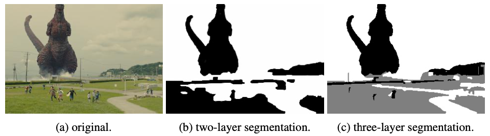
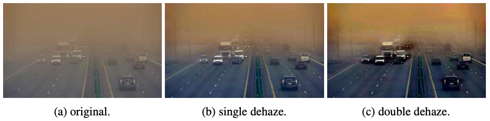

# Coupled Deep Image Prior Systems

- Nathaniel Haddad
- haddad.na@northeastern.edu
- Northeastern University
- Disclosure: this is an academic project
---

## Abstract

It is well known that deep image priors are capable of learning low-level statistics of images and videos and can be 
used as a handcrafted prior for standard inverse problems. Using these statistics under the assumption that images are 
mixtures of multiple layers of sub-images, deep image priors are able to successfully de- compose images into separate 
layers. When coupled together (Double-DIP), deep image priors become even more versatile and can be used for tasks such 
as image dehazing and image segmentation. In this paper, I show that coupled deep image priors can be linked together 
into systems that are able to produce iterative solutions to problems. I introduce two tasks to demonstrate that it is 
possible to create more complex systems of deep image priors via iterative methods and also by increasing the number of 
deep image priors in an existing Double-DIP model. I show that together, these systems can be used solve problems in 
which the resulting layers of image decomposition are many. Furthermore, this paper reinforces claims made about the 
inductive bias of deep image priors and their ability to generalize well to new problems.

[Read the paper](coupled-deep-image-prior-systems.pdf)

## Install

1. Install libaries
    - PyTorch
    - OpenCV
    - Scikit-Image
    - scipy
2. To run segmentation experiments, run `python segmentation.py`
4. To run dehazing system experiments, run `python dehazing_system.py`

## References

[1] Ulyanov, D. & Vedaldi, A. & Lempitsky, V. (2018) Deep image prior. In Proceedings of the IEEE Conference on Computer Vision and Pattern Recognition, pp. 9446–9454.

[2] Gandelsman, Y. & Schocher, A. & Irani, M. (2018) "Double-DIP": Unsupervised Image Decomposition via Coupled Deep-Image-Priors. The IEEE Conference on Computer Vision and Pattern Recognition (CVPR), pp. 11026-11035.

[3] Bahat, M. & Irani, M. (2016) Blind dehazing using internal patch recurrence. 2016 IEEE International Conference on Computational Photography (ICCP), pp. 1-9.
